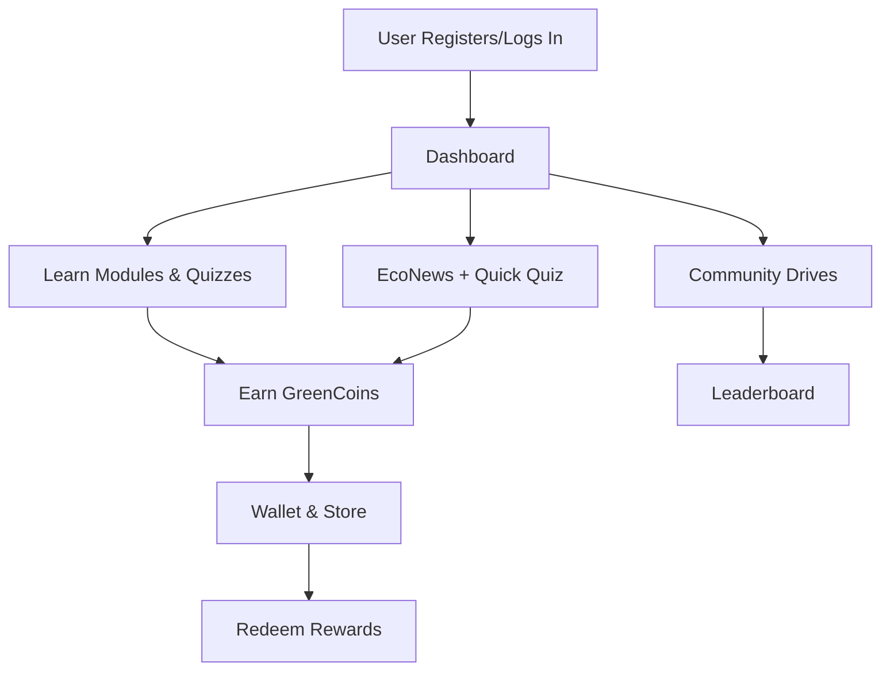
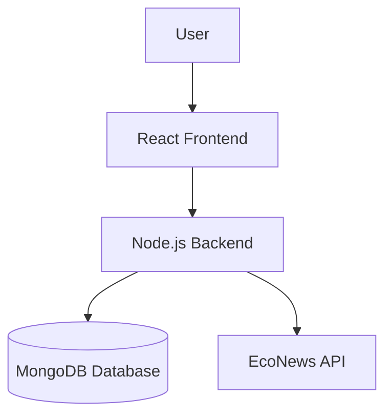

# EcoQuest – Play, Learn, Save the Planet

## 1. Project Overview

**EcoQuest** is a gamified environmental education platform designed for schools and colleges. Embracing the motto **“Play, Learn, Save the Planet”**, EcoQuest aims to make environmental learning engaging and impactful for students.

- **Purpose:** Foster environmental awareness and action through interactive, game-based learning.
- **Target Audience:** School and college students.
- **Core Idea:** Students earn **GreenCoins** by completing eco-actions, quizzes, and participating in community drives. These coins can be redeemed for real or virtual rewards, encouraging ongoing engagement and positive behavior.

---

## 2. Tech Stack

- **Frontend:** React, Tailwind CSS, [ShadCN UI](https://ui.shadcn.com/) (for a minimal, modern design)
- **Backend:** Node.js, Express
- **Database:** MongoDB (stores users, progress, coins, quizzes, news)
- **Authentication:** JWT-based login system
- **Gamification:** Points, badges, leaderboards, GreenCoin wallet system
- **News Integration:** Curated eco-news (mock DB for demo, API-ready for future)
- **Deployment:**
  - Frontend: Vercel
  - Backend: Render/Heroku
  - Database: MongoDB Atlas

---

## 3. User Flow Diagram



---

## 4. System Architecture

- **Frontend** communicates with **Backend** via REST APIs.
- **Backend** manages authentication, quiz logic, coin transactions.
- **MongoDB** stores user data, quiz bank, eco-news, and rewards.
- **EcoBot** (optional chatbot) assists users with FAQs.



---

## 5. Features

- **Gamification:**

  - Points system for eco-actions, quizzes, and participation.
  - GreenCoins as a virtual currency for rewards.
  - Badges for milestones (e.g., quiz master, eco-warrior, community leader).
  - Leaderboards (school, class, and global) to foster healthy competition.
  - Streaks and daily/weekly challenges.
  - Leveling system to unlock new content and privileges.

- **EcoNews:**

  - Curated real-world environmental news articles.
  - Quick quizzes based on news to reinforce learning.
  - Prevention tips and actionable advice with each news item.
  - Bookmark and share news stories.
  - News categories (climate, wildlife, pollution, etc.).

- **Wallet & Store:**

  - GreenCoin wallet to track earnings and spending.
  - Storefront to redeem coins for rewards (digital badges, certificates, eco-friendly products, event tickets).
  - Transaction history and reward redemption log.
  - Wishlist for desired rewards.

- **Community Drives:**

  - Join or organize eco-activities (tree planting, clean-ups, recycling drives).
  - Event calendar and sign-up system.
  - Points and badges for participation and leadership roles.
  - Photo and report submission for completed drives.
  - Community leaderboard for most active participants.

- **Journal:**

  - Personal eco-action log for daily/weekly reflections.
  - Templates and prompts for guided journaling.
  - Progress visualization (charts, streaks).
  - Option to share journal entries with peers or mentors.

- **Profile:**

  - User dashboard with progress tracking (points, coins, badges, rank).
  - Achievement showcase (badges, certificates).
  - History of completed modules, quizzes, and drives.
  - Customizable avatar and profile details.
  - Privacy settings and parental/teacher controls.

- **Quizzes & Learning Modules:**

  - Interactive modules on environmental topics (energy, waste, biodiversity, etc.).
  - Multiple-choice, true/false, and scenario-based quizzes.
  - Instant feedback and explanations for answers.
  - Module completion certificates.
  - Adaptive difficulty based on user performance.

- **Notifications & Reminders:**

  - Push/email notifications for new challenges, news, and events.
  - Reminders for streaks, upcoming drives, and reward redemption.

- **Admin & Teacher Tools:**

  - Dashboard for monitoring student progress and engagement.
  - Ability to create custom challenges and quizzes.
  - Analytics and reporting tools.

- **EcoBot (Optional):**
  - AI-powered chatbot for eco-tips, FAQs, and guidance.
  - Personalized learning recommendations.

---

## 6. Installation & Setup

1. **Clone the repository:**
   ```bash
   git clone <repo-url>
   cd eco-quest-forge-main
   ```
2. **Install dependencies:**
   ```bash
   npm install
   ```
3. **Setup environment variables:**
   - Create a `.env` file in the root directory.
   - Add the following (replace with your values):
     ```env
     MONGODB_URI=your_mongodb_atlas_uri
     JWT_SECRET=your_jwt_secret
     # Add any API keys if needed
     ```
4. **Run the backend:**
   ```bash
   npm run server
   ```
5. **Run the frontend:**
   ```bash
   npm start
   ```
6. **Access the app:**
   - Frontend: [http://localhost:3000](http://localhost:3000)
   - Backend: [http://localhost:8080](http://localhost:8080)

---

## 7. Future Enhancements

- Live eco-news integration via APIs (e.g., NewsAPI, GNews)
- AI-powered EcoBot for personalized eco-tips and FAQs
- Mobile app version (React Native or Flutter)
- AR/VR-based eco-games for immersive learning
- Integration with school management systems (LMS, SIS)
- Real-time community drive tracking with geolocation
- Social sharing and peer challenges

---

## 8. License & Contributors

- **License:** MIT
- **Contributors:**
  - [Your Team Name / Members]
  - Special thanks to open-source libraries and the environmental education community.

---

_EcoQuest – Inspiring the next generation of eco-heroes!_

